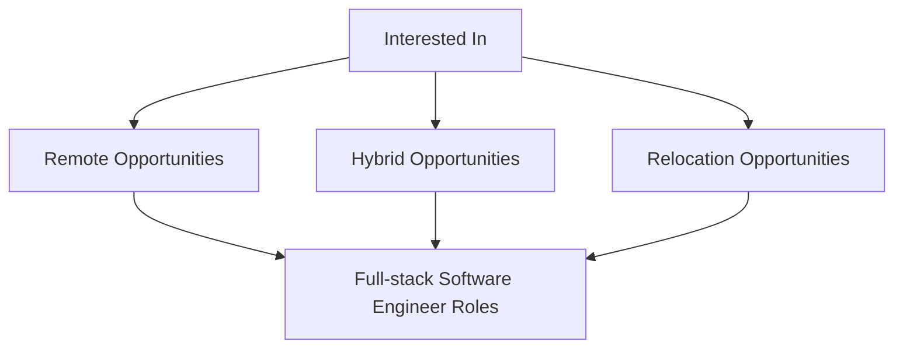

Hi My name is Oluwatobi Adesanya
====================================================================================================================================

A Full-Stack Software Engineer
------------------------------
I'm a Full-Stack Software Engineer with excellent problem-solving skills, building scalable, maintainable, and efficient applications across both frontend and backend. I thrive in agile, collaborative environments where business goals and user experience drive technical decisions.

Frontend:
- React, Next.js TypeScript, Tailwind CSS  
- Component-driven architecture, performance optimization, accessibility-first design

Backend:
- Node.js, NestJS, Express  
- RESTful APIs, authentication systems, scalable service architecture  
- Databases: PostgreSQL, MySQL, MongoDB

Cloud Deployment:
- AWS (EC2, S3, IAM), Linux-based environments   
- Application hosting, CI/CD pipelines, domain/DNS configuration 
- Database provisioning and management

Development Principles:
- Clean code, test coverage, CI/CD workflows  
- Business-driven development — prioritizing value delivery and product impact  
- Clear documentation and technical writing to support teams and onboarding

I'm open to remote opportunities and relocation, and passionate about contributing to meaningful products and high-performing teams.

* 🌍  I'm currently living in Ibadan, Nigeria, and I am ready to relocate when the right opportunity comes.
* ✉️  You can contact me at [tobbey.adesanya@gmail.com](mailto:tobbey.adesanya@gmail.com)  
* 🧠  I'm currently advancing my knowledge of Architectural designs
* 🤝  I'm open to collaborating on Open Source Projects
* ⚡  Let's create extraordinary solutions out of ordinary!

### I am eager to connect with you 😁!

### Skills

  

 

### Socials

      

### Badges

